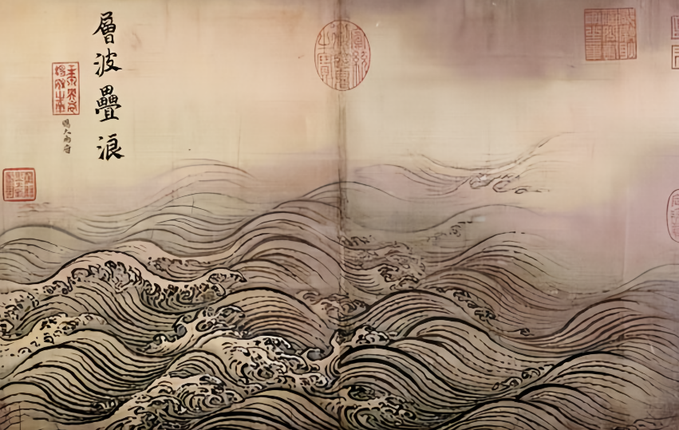

# String Quartet No.1 
>
### This piece was composed by 夏海闻 since May, 2023 and first released in August, 2024    

## Structure:  
        1-15: Introduction  
        16-17: First "Motto" 
        18-90: Exposition   
            18-28: First Theme
            29-64: Second Theme (using material from the introduction)
            65-81: Transition (using the first theme)
            82-90: Third Theme   
        91-142: Episode 1 ("Fugue" + Coda)
        143-148: Second "Motto"
        149-188: Recapitulation (Introduction + Second Theme)
        189-279: Development Section (Theme interpretated with Chinese musical elements)
        280-295: Second "Motto"
        296-334: Episode 2 (Rondo)
        335-344: First "Motto"
        345-348: Coda
There are cross-references between the sections

***
**I attempt to record the dance of life, where characters take the stage in full regalia, only to be grounded into dust.**

**I attempt to fill the void with nothingness.**

**I attempt to capture the trace of fate, listening to its footsteps, witnessing its masterful works, and mocking it within my power.**

**I attempt to retain the happiness hard-won.**

**I attempt to provide the ultimate answer.**

